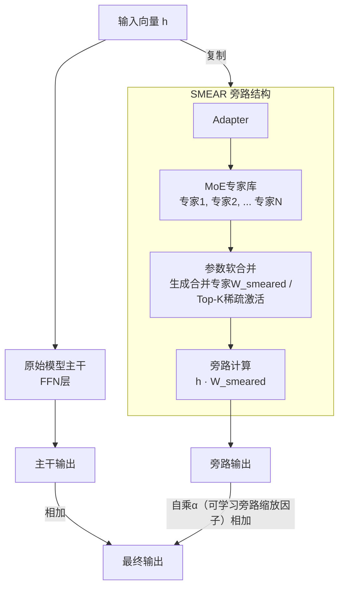

## 实验结果
- 通过SMEAR项目(https://arxiv.org/abs/2306.03745)中的adapter微调方法，基于非MoE的decoder-only transformer模型，实现对不同路由策略的比较


- 实验表明在 ```因果路由分段+专家参数聚合``` 条件下，模型在困惑度、loss等表现与 ```token+专家参数聚合```基本一致，不表现出信息损失带来的可能低准确率的问题，在都使用 ```Top-K稀疏激活```条件下，```token级路由```比```段级路由```在模型最终表现上有优势，但是可能需要在较长文本上进行进一步测试，Lory(https://arxiv.org/abs/2405.03133v2)中的设计聚焦于长文本语料的预训练，目前正在使用 Bookcorpus数据集进行测试 

## 可能应用
- 包的数量减少
- 段级的路由在计算时间上更长，一定程度上便于调度计算重叠通信

```mermaid
gantt
    dateFormat  X
    axisFormat %s
    
    section MB1段1
    ATTN计算 :0, 2s
    Dispatch通信 :2, 1s
    FFN计算 :3, 3s
    Combine通信 :6, 1s
    
    section MB2段1
    ATTN计算 :1, 2s
    Dispatch通信 :3, 1s
    FFN计算 :4, 3s
    Combine通信 :7, 1s
    
    section MB1段2
    ATTN计算 :2, 2s
    Dispatch通信 :4, 1s
    FFN计算 :5, 3s
    Combine通信 :8, 1s
    
    section MB2段2
    ATTN计算 :3, 2s
    Dispatch通信 :5, 1s
    FFN计算 :6, 3s
    Combine通信 :9, 1s
```

- 在推理优化中，如果处于计算资源受限的场景，参考论文(https://arxiv.org/abs/2505.16056)中提到的Expert Offloading，通过局部路由一致性便于快速内存(显存)中的专家参数驻留计算，而段级路由局部路由一致性较好，适合此场景

## 存在问题
- 段级路由间的因果性使得段间无法并行，而无因果的段级路由信息损失明显，在模型最终表现上较差。可能需要microbatch等方法来支持因果分段路由